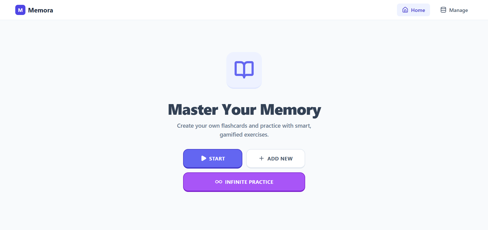

<div align="center">

</div>

## Memora

Aplikasi flashcard sederhana untuk membantu kamu mengingat **kata** dan **definisi** lewat latihan pilihan ganda yang cepat dan gamified.

> Data disimpan lokal di browser (localStorage). Tidak butuh akun.

### Preview



## Fitur

- **Buat flashcard sendiri**
  - Tipe **WORD**: `term` + beberapa `meanings/terjemahan`
  - Tipe **DEFINITION**: `term` + `description/definisi panjang`
- **Library / Manage**
  - Edit item, hapus item
  - Toggle aktif/nonaktif (hanya item aktif yang ikut latihan)
  - Statistik per item: `correct` / `incorrect` + persentase
- **Exercise (Latihan)**
  - **Normal mode**: jumlah soal per sesi mengikuti setting “Max Questions”
  - **Infinite mode**: lanjut terus (soal ditambahkan satu per satu)
  - Pilih fokus latihan: **Mix All**, **Words Only**, atau **Definitions Only**
  - Feedback benar/salah + highlight jawaban benar
- **Sound effects** (Tone.js) untuk klik, benar/salah, dan selesai sesi

## Cara Pakai (User Flow)

1. Buka halaman **Home**
2. Tambahkan item via **Add New** (atau lewat menu **Manage**)
3. Pastikan ada minimal **4 item aktif** (syarat untuk mulai latihan)
4. Klik **Start** (Normal) atau **Infinite Practice**
5. Pilih fokus: Mix / Word / Definition
6. Jawab pilihan ganda (4 opsi), lihat hasil sesi di layar finish

## Tech Stack

- React + TypeScript
- Vite
- React Router (HashRouter) — friendly untuk GitHub Pages
- Tailwind CSS via CDN
- Tone.js untuk audio
- Lucide React untuk ikon

## Menjalankan Secara Lokal

### Prerequisites

- Node.js (disarankan versi LTS)
- npm

### Install & Run

```bash
npm install
npm run dev
```

Lalu buka `http://localhost:3000`.

### Build & Preview

```bash
npm run build
npm run preview
```

## Deploy (GitHub Pages)

Project ini sudah menyiapkan script `gh-pages`:

```bash
npm run deploy
```

## PWA (Installable Web App)

Project ini sudah disiapkan menjadi PWA menggunakan `vite-plugin-pwa`.

### Lokasi file ikon

Taruh file ikon di folder berikut:

- `public/icons/`
- `public/apple-touch-icon.png` (untuk iOS)

Nama file yang dipakai oleh manifest:

- `public/icons/pwa-192x192.png`
- `public/icons/pwa-512x512.png`
- `public/icons/pwa-192x192-maskable.png`
- `public/icons/pwa-512x512-maskable.png`

### Spesifikasi ikon (disarankan)

- PNG, background solid/transparan sesuai desain
- Ukuran wajib untuk PWA: `192x192` dan `512x512`
- Versi `maskable` disarankan (agar aman saat di-crop oleh launcher Android)
- iOS Home Screen: `apple-touch-icon.png` ukuran `180x180`

### Cara test PWA

1. Build & preview:

```bash
npm run build
npm run preview
```

2. Buka URL preview, lalu di Chrome/Edge:

- DevTools → Application → Manifest / Service Workers
- Atau jalankan Lighthouse → kategori PWA
- Tombol install biasanya muncul di address bar (kalau memenuhi syarat)

## Penyimpanan Data

- Items disimpan di localStorage dengan key: `memora_items`
- Settings disimpan di localStorage dengan key: `memora_settings`
- Default setting: `maxQuestionsPerSession = 10`

## Catatan

- Audio di browser biasanya baru aktif setelah ada interaksi user pertama (klik/tap). Kalau suara tidak muncul di awal, coba klik sekali di UI.
- Untuk mulai latihan, app butuh minimal **4 item aktif** (sesuai logic generator soal).
